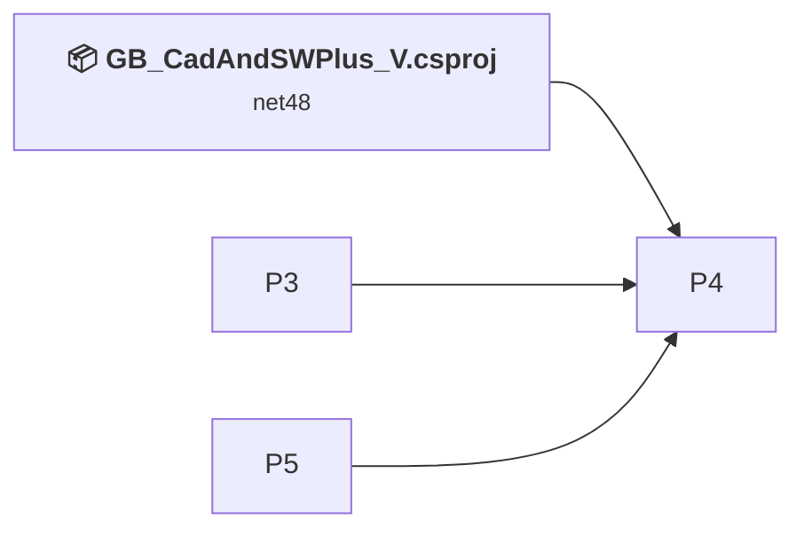
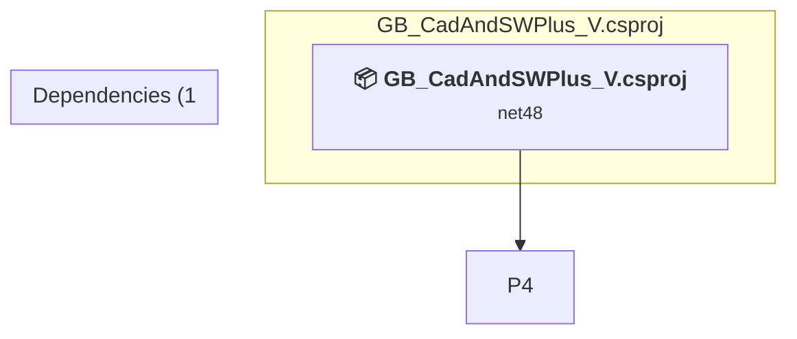

# Projects and dependencies analysis

This document provides a comprehensive overview of the projects and their dependencies in the context of upgrading to .NETFramework,Version=v4.8.

## Table of Contents

- [Executive Summary](#executive-Summary)
  - [Highlevel Metrics](#highlevel-metrics)
  - [Projects Compatibility](#projects-compatibility)
  - [Package Compatibility](#package-compatibility)
  - [API Compatibility](#api-compatibility)
  - [Binding Redirect Configuration](#binding-redirect-configuration)
- [Aggregate NuGet packages details](#aggregate-nuget-packages-details)
- [Top API Migration Challenges](#top-api-migration-challenges)
  - [Technologies and Features](#technologies-and-features)
  - [Most Frequent API Issues](#most-frequent-api-issues)
- [Projects Relationship Graph](#projects-relationship-graph)
- [Project Details](#project-details)

  - [%USERPROFILE%\source\repos\GB_CadAndSWPlus_V_Solution\GB_CadAndSWPlus_V_Server\GB_CadAndSWPlus_V_Server.csproj](#%userprofile%sourcereposgb_cadandswplus_v_solutiongb_cadandswplus_v_servergb_cadandswplus_v_servercsproj)
  - [%USERPROFILE%\source\repos\GB_CadAndSWPlus_V_Solution\GB_CadAndSWPlus_V_Shared\GB_CadAndSWPlus_V_Shared.csproj](#%userprofile%sourcereposgb_cadandswplus_v_solutiongb_cadandswplus_v_sharedgb_cadandswplus_v_sharedcsproj)
  - [%USERPROFILE%\source\repos\GB_CadAndSWPlus_V_Solution\GB_CadAndSWPlus_V_SolidWorksAddIn\GB_CadAndSWPlus_V_SolidWorksAddIn.csproj](#%userprofile%sourcereposgb_cadandswplus_v_solutiongb_cadandswplus_v_solidworksaddingb_cadandswplus_v_solidworksaddincsproj)
  - [%USERPROFILE%\source\repos\GB_CadAndSWPlus_V_Solution\GB_CadAndSWPlus_V_Tray\GB_CadAndSWPlus_V_Tray.csproj](#%userprofile%sourcereposgb_cadandswplus_v_solutiongb_cadandswplus_v_traygb_cadandswplus_v_traycsproj)
  - [GB_CadAndSWPlus_V.csproj](#gb_cadandswplus_vcsproj)

## Executive Summary

### Highlevel Metrics

| Metric | Count | Status |
| :--- | :---: | :--- |
| Total Projects | 5 | 3 require upgrade |
| Total NuGet Packages | 51 | All compatible |
| Total Code Files | 167 |  |
| Total Code Files with Incidents | 3 |  |
| Total Lines of Code | 108198 |  |
| Total Number of Issues | 4 |  |
| Estimated LOC to modify | 0+ | at least 0.0% of codebase |

### Projects Compatibility

| Project | Target Framework | Difficulty | Package Issues | API Issues | Binding Issues | Est. LOC Impact | Description |
| :--- | :---: | :---: | :---: | :---: | :---: | :---: | :--- |
| [%USERPROFILE%\source\repos\GB_CadAndSWPlus_V_Solution\GB_CadAndSWPlus_V_Server\GB_CadAndSWPlus_V_Server.csproj](#%userprofile%sourcereposgb_cadandswplus_v_solutiongb_cadandswplus_v_servergb_cadandswplus_v_servercsproj) | net8.0 | 🟢 Low | 1 | 0 | 0 |  | AspNetCore, Sdk Style = True |
| [%USERPROFILE%\source\repos\GB_CadAndSWPlus_V_Solution\GB_CadAndSWPlus_V_Shared\GB_CadAndSWPlus_V_Shared.csproj](#%userprofile%sourcereposgb_cadandswplus_v_solutiongb_cadandswplus_v_sharedgb_cadandswplus_v_sharedcsproj) | net472 | 🟢 Low | 0 | 0 | 0 |  | Wpf, Sdk Style = True |
| [%USERPROFILE%\source\repos\GB_CadAndSWPlus_V_Solution\GB_CadAndSWPlus_V_SolidWorksAddIn\GB_CadAndSWPlus_V_SolidWorksAddIn.csproj](#%userprofile%sourcereposgb_cadandswplus_v_solutiongb_cadandswplus_v_solidworksaddingb_cadandswplus_v_solidworksaddincsproj) | net472 | 🟢 Low | 0 | 0 | 0 |  | WinForms, Sdk Style = True |
| [%USERPROFILE%\source\repos\GB_CadAndSWPlus_V_Solution\GB_CadAndSWPlus_V_Tray\GB_CadAndSWPlus_V_Tray.csproj](#%userprofile%sourcereposgb_cadandswplus_v_solutiongb_cadandswplus_v_traygb_cadandswplus_v_traycsproj) | net48 | ✅ None | 0 | 0 | 0 |  | Wpf, Sdk Style = True |
| [GB_CadAndSWPlus_V.csproj](#gb_cadandswplus_vcsproj) | net48 | ✅ None | 0 | 0 | 0 |  | Wpf, Sdk Style = True |

### Package Compatibility

| Status | Count | Percentage |
| :--- | :---: | :---: |
| ✅ Compatible | 51 | 100.0% |
| ⚠️ Incompatible | 0 | 0.0% |
| 🔄 Upgrade Recommended | 0 | 0.0% |
| ***Total NuGet Packages*** | ***51*** | ***100%*** |

### API Compatibility

| Category | Count | Impact |
| :--- | :---: | :--- |
| 🔴 Binary Incompatible | 0 | High - Require code changes |
| 🟡 Source Incompatible | 0 | Medium - Needs re-compilation and potential conflicting API error fixing |
| 🔵 Behavioral change | 0 | Low - Behavioral changes that may require testing at runtime |
| ✅ Compatible | 21668 |  |
| ***Total APIs Analyzed*** | ***21668*** |  |

## Aggregate NuGet packages details

| Package | Current Version | Suggested Version | Projects | Description |
| :--- | :---: | :---: | :--- | :--- |
| AutoCAD.NET | 20.0.0 |  | [GB_CadAndSWPlus_V.csproj](#gb_cadandswplus_vcsproj) | ✅Compatible |
| AutoCAD.NET.Core | 20.0.0 |  | [GB_CadAndSWPlus_V.csproj](#gb_cadandswplus_vcsproj) | ✅Compatible |
| AutoCAD.NET.Model | 20.0.0 |  | [GB_CadAndSWPlus_V.csproj](#gb_cadandswplus_vcsproj) | ✅Compatible |
| BouncyCastle.Cryptography | 2.6.2 |  | [GB_CadAndSWPlus_V.csproj](#gb_cadandswplus_vcsproj) | ✅Compatible |
| Costura.Fody | 6.2.0 |  | [GB_CadAndSWPlus_V.csproj](#gb_cadandswplus_vcsproj) | ✅Compatible |
| Dapper | 2.1.66 |  | [GB_CadAndSWPlus_V.csproj](#gb_cadandswplus_vcsproj) | ✅Compatible |
| Dapper.Database | 6.0.0.23 |  | [GB_CadAndSWPlus_V.csproj](#gb_cadandswplus_vcsproj) | ✅Compatible |
| DM.DmProvider | 8.3.1.47463 |  | [GB_CadAndSWPlus_V.csproj](#gb_cadandswplus_vcsproj) | ✅Compatible |
| Enums.NET | 5.0.0 |  | [GB_CadAndSWPlus_V.csproj](#gb_cadandswplus_vcsproj) | ✅Compatible |
| ExtendedNumerics.BigDecimal | 2025.1001.2.129 |  | [GB_CadAndSWPlus_V.csproj](#gb_cadandswplus_vcsproj) | ✅Compatible |
| Fody | 6.9.3 |  | [GB_CadAndSWPlus_V.csproj](#gb_cadandswplus_vcsproj) | ✅Compatible |
| Google.Protobuf | 3.32.0 |  | [GB_CadAndSWPlus_V.csproj](#gb_cadandswplus_vcsproj) | ✅Compatible |
| IFox.CAD.ACAD | 0.9.9.1 |  | [GB_CadAndSWPlus_V.csproj](#gb_cadandswplus_vcsproj) | ✅Compatible |
| K4os.Compression.LZ4 | 1.3.8 |  | [GB_CadAndSWPlus_V.csproj](#gb_cadandswplus_vcsproj) | ✅Compatible |
| K4os.Compression.LZ4.Streams | 1.3.8 |  | [GB_CadAndSWPlus_V.csproj](#gb_cadandswplus_vcsproj) | ✅Compatible |
| K4os.Hash.xxHash | 1.0.8 |  | [GB_CadAndSWPlus_V.csproj](#gb_cadandswplus_vcsproj) | ✅Compatible |
| MathNet.Numerics.Signed | 5.0.0 |  | [GB_CadAndSWPlus_V.csproj](#gb_cadandswplus_vcsproj) | ✅Compatible |
| Microsoft.Bcl.AsyncInterfaces | 10.0.9 |  | [GB_CadAndSWPlus_V.csproj](#gb_cadandswplus_vcsproj) | ✅Compatible |
| Microsoft.Bcl.HashCode | 6.0.0 |  | [GB_CadAndSWPlus_V.csproj](#gb_cadandswplus_vcsproj) | ✅Compatible |
| Microsoft.Build.Tasks.Git | 8.0.0 |  | [GB_CadAndSWPlus_V.csproj](#gb_cadandswplus_vcsproj) | ✅Compatible |
| Microsoft.CSharp | 4.7.0 |  | [GB_CadAndSWPlus_V.csproj](#gb_cadandswplus_vcsproj) | ✅Compatible |
| Microsoft.IO.RecyclableMemoryStream | 3.0.1 |  | [GB_CadAndSWPlus_V.csproj](#gb_cadandswplus_vcsproj) | ✅Compatible |
| Microsoft.SourceLink.Common | 8.0.0 |  | [GB_CadAndSWPlus_V.csproj](#gb_cadandswplus_vcsproj) | ✅Compatible |
| Microsoft.SourceLink.GitHub | 8.0.0 |  | [GB_CadAndSWPlus_V.csproj](#gb_cadandswplus_vcsproj) | ✅Compatible |
| MySql.Data | 9.7.0 |  | [GB_CadAndSWPlus_V.csproj](#gb_cadandswplus_vcsproj) | ✅Compatible |
| Newtonsoft.Json | 13.0.4 |  | [GB_CadAndSWPlus_V.csproj](#gb_cadandswplus_vcsproj) | ✅Compatible |
| NPOI | 2.8.0 |  | [GB_CadAndSWPlus_V.csproj](#gb_cadandswplus_vcsproj) | ✅Compatible |
| SharpZipLib | 1.4.2 |  | [GB_CadAndSWPlus_V.csproj](#gb_cadandswplus_vcsproj) | ✅Compatible |
| SkiaSharp | 3.119.4 |  | [GB_CadAndSWPlus_V.csproj](#gb_cadandswplus_vcsproj) | ✅Compatible |
| SkiaSharp.NativeAssets.Linux.NoDependencies | 3.119.2 |  | [GB_CadAndSWPlus_V.csproj](#gb_cadandswplus_vcsproj) | ✅Compatible |
| SkiaSharp.NativeAssets.macOS | 3.119.4 |  | [GB_CadAndSWPlus_V.csproj](#gb_cadandswplus_vcsproj) | ✅Compatible |
| SkiaSharp.NativeAssets.Win32 | 3.119.4 |  | [GB_CadAndSWPlus_V.csproj](#gb_cadandswplus_vcsproj) | ✅Compatible |
| System.Buffers | 4.6.1 |  | [GB_CadAndSWPlus_V.csproj](#gb_cadandswplus_vcsproj) | ✅Compatible |
| System.Collections.Immutable | 10.0.10 |  | [GB_CadAndSWPlus_V.csproj](#gb_cadandswplus_vcsproj) | ✅Compatible |
| System.ComponentModel.Annotations | 5.0.0 |  | [GB_CadAndSWPlus_V.csproj](#gb_cadandswplus_vcsproj) | ✅Compatible |
| System.Configuration.ConfigurationManager | 10.0.9 |  | [GB_CadAndSWPlus_V.csproj](#gb_cadandswplus_vcsproj) | ✅Compatible |
| System.Formats.Nrbf | 10.0.10 |  | [GB_CadAndSWPlus_V.csproj](#gb_cadandswplus_vcsproj) | ✅Compatible |
| System.IO.Pipelines | 10.0.9 |  | [GB_CadAndSWPlus_V.csproj](#gb_cadandswplus_vcsproj) | ✅Compatible |
| System.Memory | 4.6.3 |  | [GB_CadAndSWPlus_V.csproj](#gb_cadandswplus_vcsproj) | ✅Compatible |
| System.Numerics.Vectors | 4.6.1 |  | [GB_CadAndSWPlus_V.csproj](#gb_cadandswplus_vcsproj) | ✅Compatible |
| System.Reflection.Metadata | 10.0.10 |  | [GB_CadAndSWPlus_V.csproj](#gb_cadandswplus_vcsproj) | ✅Compatible |
| System.Resources.Extensions | 10.0.10 |  | [GB_CadAndSWPlus_V.csproj](#gb_cadandswplus_vcsproj) | ✅Compatible |
| System.Runtime.CompilerServices.Unsafe | 6.1.2 |  | [GB_CadAndSWPlus_V.csproj](#gb_cadandswplus_vcsproj) | ✅Compatible |
| System.Security.Cryptography.Xml | 8.0.2 |  | [GB_CadAndSWPlus_V.csproj](#gb_cadandswplus_vcsproj) | ✅Compatible |
| System.Text.Encoding.CodePages | 8.0.0 |  | [GB_CadAndSWPlus_V.csproj](#gb_cadandswplus_vcsproj) | ✅Compatible |
| System.Text.Encodings.Web | 10.0.9 |  | [GB_CadAndSWPlus_V.csproj](#gb_cadandswplus_vcsproj) | ✅Compatible |
| System.Text.Json | 10.0.9 |  | [GB_CadAndSWPlus_V.csproj](#gb_cadandswplus_vcsproj) | ✅Compatible |
| System.Threading.Tasks.Extensions | 4.6.3 |  | [GB_CadAndSWPlus_V.csproj](#gb_cadandswplus_vcsproj) | ✅Compatible |
| System.ValueTuple | 4.6.2 |  | [GB_CadAndSWPlus_V.csproj](#gb_cadandswplus_vcsproj) | ✅Compatible |
| ZstdSharp.Port | 0.8.6 |  | [GB_CadAndSWPlus_V.csproj](#gb_cadandswplus_vcsproj) | ✅Compatible |
| ZString | 2.6.0 |  | [GB_CadAndSWPlus_V.csproj](#gb_cadandswplus_vcsproj) | ✅Compatible |

## Top API Migration Challenges

### Technologies and Features

| Technology | Issues | Percentage | Migration Path |
| :--- | :---: | :---: | :--- |

### Most Frequent API Issues

| API | Count | Percentage | Category |
| :--- | :---: | :---: | :--- |

## Projects Relationship Graph

Legend:
📦 SDK-style project
⚙️ Classic project

## Project Details

### GB_CadAndSWPlus_V.csproj

#### Project Info

- **Current Target Framework:** net48✅
- **SDK-style**: True
- **Project Kind:** Wpf
- **Dependencies**: 1
- **Dependants**: 0
- **Number of Files**: 209
- **Lines of Code**: 90955
- **Estimated LOC to modify**: 0+ (at least 0.0% of the project)

#### Dependency Graph

Legend:
📦 SDK-style project
⚙️ Classic project

### API Compatibility

| Category | Count | Impact |
| :--- | :---: | :--- |
| 🔴 Binary Incompatible | 0 | High - Require code changes |
| 🟡 Source Incompatible | 0 | Medium - Needs re-compilation and potential conflicting API error fixing |
| 🔵 Behavioral change | 0 | Low - Behavioral changes that may require testing at runtime |
| ✅ Compatible | 0 |  |
| ***Total APIs Analyzed*** | ***0*** |  |

